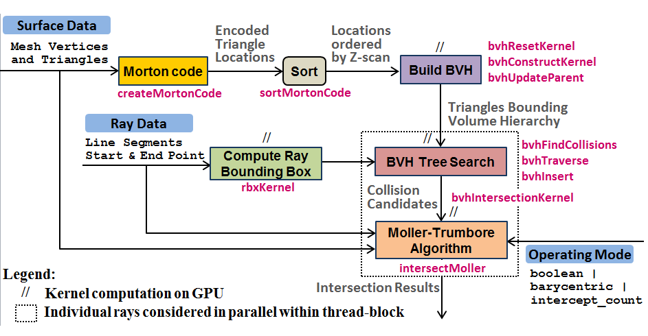
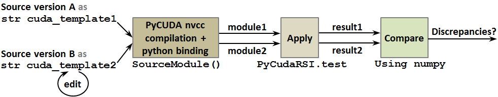
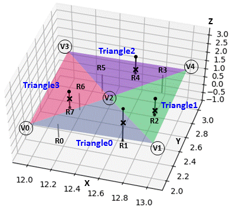
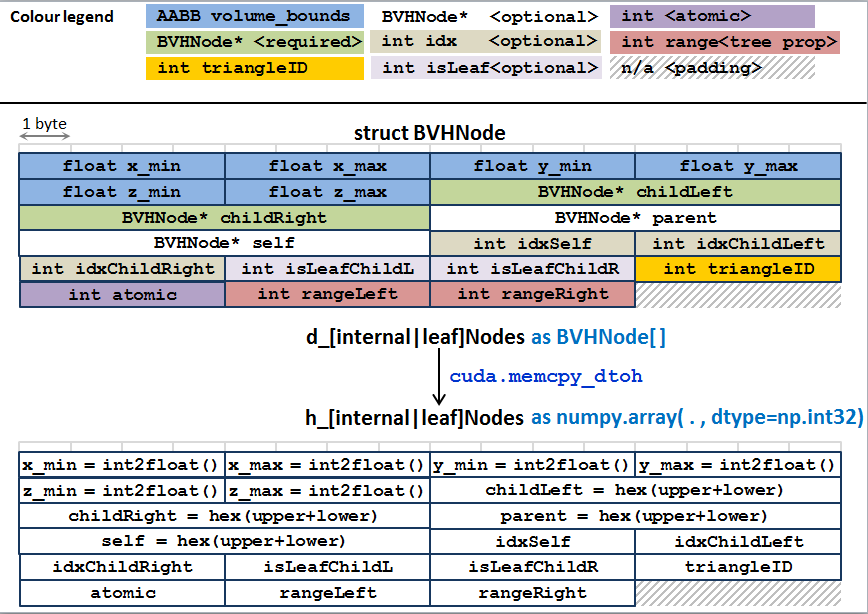
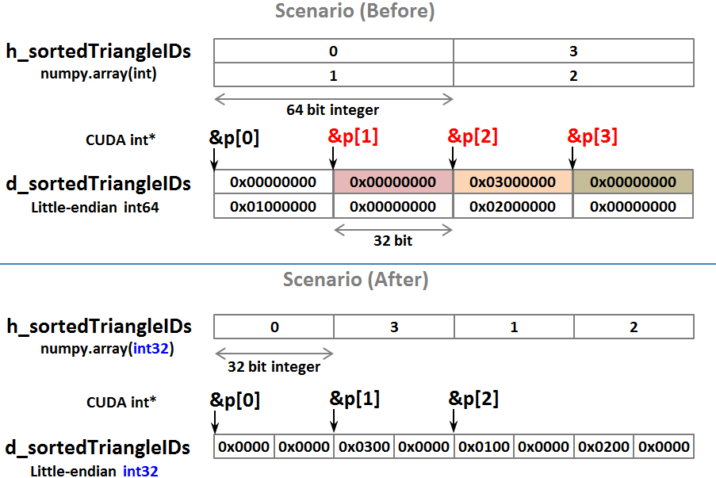
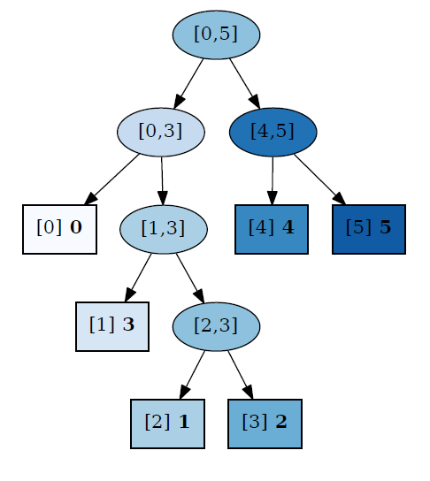
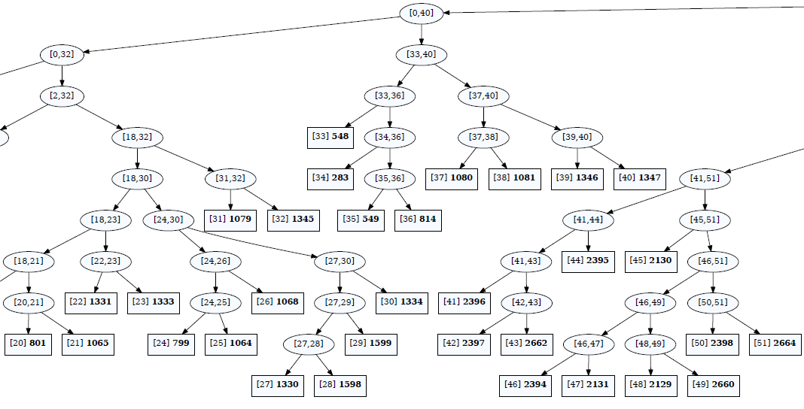

Credit: https://github.com/raymondleung8/gpu-ray-surface-intersection-in-cuda

# PyCUDA implementation of ray-surface intersection tests
> This post is available for download in [PDF format](../doc/pycuda-experience.pdf)

This directory provides a stand-alone implementation of the entire library in PyCUDA. It supports the following <a name="use_cases">use cases</a> which had existed since commit 1edbd3e39f2f61e77995df34868d3ab7322ba7af.

- <b>Standard usage (`mode=boolean`)</b>
  - This returns a boolean indicating whether or not each ray intersects with the surface.
- <b>Extended usage (`mode=barycentric`)</b>
  - This returns the intersecting triangle and nearest intersecting point
    for each surface intersecting ray.
- <b>Experimental feature (`mode=intercept_count`)</b>
  - This returns the number of unique intersections with the surface for each ray.

## Overview
As a quick recap, the following flowchart shows the main components in the existing CUDA implementation. The core elements are described in Sections 2-3 of this [document](https://arxiv.org/pdf/2209.02878/ms.pdf#page=2).
</a>

## PyCUDA: What is it and why use it?

[PyCUDA](http://arxiv.org/abs/0911.3456) represents a Python scripting-based approach to GPU run-time code generation. It gives the programmer Pythonic access to Nvidia's parallel computation API. It allows raw CUDA code to be embedded as a string `s` within a Python script, parsed by `pycuda.compilerSourceModule`, compiled using nvcc (the CUDA compiler driver) and linked against the CUDA runtime library. The command `compilerSourceModule(s)` returns a module object `m` which exposes CUDA kernels (`__global__` functions) to the user via `m.get_function(<cuda_kernel_name>)` using the `cuModuleGetFunction` API.

> In CUDA terminology, a `__global__` function represents kernel code that is executed in an Nvidia GPU. All dependent functions called by the kernel are declared with the `__device__` specifier.

Several features may be noted based on the PyCUDA [documentation](https://documen.tician.de/pycuda/)
- <i>Resource management</i> is tied to lifetime of objects (akin to RAII idiom in C++). PyCUDA knows about dependencies, it won't detach from a context before all memory allocated in it is also freed.
- <i>Automatic error checking</i> - PyCUDA is strict about argument types and Boost python bindings for kernel APIs. CUDA errors are translated into Python exceptions.
- <i>Accessible</i> - The kernel APIs of interest are completely at the user's disposal.
- <i>Speed</i> - PyCUDA's base layer is written in C++, so it has negligible impact on throughput performance.

### Working with two versions of the source at the same time
To compare the results produced by two different versions of the source, we can work with both at the same time without needing to switch between git branches, compiling and testing the code one after the other. Instead, the following workflow may be used within a Python environment. [Note: For simplicity, the compiler cache is not shown in this figure] This could be useful when we need assurance that incremental changes do not alter the test outcomes during development. The results may be compared using numpy functions and any differences can be easily identified. This scenario is shown in [pycuda/demo.py](https://github.com/raymondleung8/gpu-ray-surface-intersection-in-cuda/tree/main/pycuda/demo.py) `run_example3`.

</a>

In `pycuda_ray_surface_intersect.py`, the `try` clause in `perform_bindings_` and conditional statements associated with `self.kernel_intersect_*` are used jointly to manage an asymmetric situation where kernels absent from the legacy code (version A of the CUDA module) are introduced in the `development` code (version B).

## PyCUDA Installation

### Requirements
The prerequisites are listed in the official PyCUDA [website](https://wiki.tiker.net/PyCuda/Installation/Linux/). In essence, PyCUDA requires a
- [CUDA-capable Nvidia GPU](https://docs.nvidia.com/cuda/cuda-c-programming-guide/index.html#compute-capabilities),
- Working [Python installation](https://www.python.org/) (in our case, version 3.8)
- C++ compiler preferrably [GCC](https://gcc.gnu.org/) and
- Access to Nvidia's [CUDA toolkit](https://developer.nvidia.com/cuda-toolkit)

Several ENVIRONMENT variables should be set before pip install is attempted. For the author, the following commands resulted in a successful installation.

```bash
$ export PATH=/usr/local/cuda-11.2/bin${PATH:+:${PATH}}
$ export LD_LIBRARY_PATH=/usr/local/cuda-11.2/lib64${LD_LIBRARY_PATH:+:${LD_LIBRARY_PATH}}
$ export CUDA_INC_DIR=/usr/local/cuda-11.2/include
$ pip3 install pycuda
```
- The Python packages in my virtual environment are shown in [requirements.txt](pycuda/requirements.txt)

## PyCUDA ray-surface intersection library: Usage

```python
from pycuda_ray_surface_intersect import PyCudaRSI

design_params = dict()
cfg = {'mode': mode}  #Valid options: ['boolean','barycentric','intercept_count']

with PyCudaRSI(design_params) as pycu:
    if mode != 'barycentric':
        ray_intersects = pycu.test(vertices, triangles, raysFrom, raysTo, cfg)
    else:
        (intersecting_rays, distances, hit_triangles, hit_points) \
                = pycu.test(vertices, triangles, raysFrom, raysTo, cfg)    
```
Refer to [`pycuda/demo.py`](demo.py) for further comments and diagnostic features.

## PyCUDA Implementation

The core functionalities are implemented in [`pycuda_ray_surface_intersect.py`](pycuda_ray_surface_intersect.py). Within this script, the C++/CUDA source code is retrieved from [`pycuda_source.py`](pycuda_source.py) using `get_cuda_template()`. It returns a module string which contains nearly the same code as found in "rsi_geometry.h", "morton3D.h" and "bvh_structure.h". This separation is not technically necessary, but it makes the the class <font color=#cc0066>`PyCudaRSI`</font> in `pycuda_ray_surface_intersect.py` more readable. `PyCudaRSI` (more or less) replicates the code found in `gpu_ray_surface_intersect.cu` and provides user with high-level interfaces that support the three primary [use cases](#use_cases).

### Refactoring existing CUDA code for PyCUDA

By default, PyCUDA sets `no_extern_c = False`. This has the effect of wrapping the entire source code specified in the `cuda_template` with `extern "C" {}` which prevents C++ [name mangling](https://en.wikipedia.org/wiki/Name_mangling) and allows the APIs of interest to be identified. This means, if the `#include <vector>` statement from "bvh_structure.h" is retained [note: STL is only permitted in host code, it is never used in device code], it would trigger a linkage error like
> `include/c++/6.2.1/bits/stl_iterator_base_types.h(116): Error: this declaration may not have extern "C" linkage`.

PyCUDA also doesn't like overloaded functions. Although it allows templated `__device__` functions to be used, templated kernel functions (like `template <typename M>
__global__ void bvhConstruct`) appear to be unsupported. These resulted in some changes that differ from the original CUDA code.

#### Specific changes
- From "bvh_structure.h", the host function `void inline createMortonCode(const vector<T> &vertices, const vector<int> &triangles,...)` is converted into a kernel `__global__ kernelMortonCode(const float* vertices, const int* triangles,...)`.
  - This becomes accessible in Python with the binding `kernel_create_morton_code = m.get_function("kernelMortonCode")` which allows the location of mesh triangles to be transformed into 64-bit Morton codes.
- Sorting of the Morton codes, which essentially organises the triangles into local clusters to preserve spatial proximity, is no longer performed using a C++ host function. Instead, it is done in python, and the result is subsequently copied to device memory `d_sortedTriangleIDs`.
- From "morton3D.h", the `template<typename morton, typename coord>` parameters are removed. Instead, the types `MORTON, COORD` in the `cuda_template` are substituted with concrete types using a dictionary (e.g. `{"MORTON": "uint64_t", "COORD": "unsigned int"}`) before being parsed by `pycuda.compilerSourceModule(...)`.
- Finally, our existing CUDA implementation makes extensive use of custom data structures (such as axes-aligned bounding box `AABB`, `BVHNode`, `CollisionList` and `InterceptDistances`). For native types like float*, device memory allocation can be done simply using `d_vertices = cuda.mem_alloc(h_vertices.nbytes)` for instance, where `h_vertices` is a numpy.array of type `numpy.float32` and shape `(n_vertices,3)`. For C structures, a helper method `struct_size(cuda_szQuery, d_answer)` is defined to convey the bytesize of the relevant structure to Python. This must be known in order to allocate global memory on the GPU device using PyCUDA.
  - Here, `cuda_szQuery` refers to the Python interface to a getSize function such as `__global__ void bytesInBVHNode(int &x){ x = sizeof(BVHNode); }`.
  - The bytesize should not be hardcoded because memory padding may be introduced at compile time, and the extent may vary depending on the device architecture.
- Despite these differences, the code in [`pycuda_ray_surface_intersect.py`](pycuda_ray_surface_intersect.py) is remarkably similar to the existing CUDA implementation.

## Lessons learned

A significant advantage is that <font color=#cc0066>PyCUDA can make device code easier to debug</font>. This in part is due to the ease with which device memory can be copied to the host for inspection as numpy.arrays. However, there are also pitfalls that developers need to be mindful of. In the ensuing discussion, we examine two situations: one concerns abnormal test results, another resulted in the program crashing due to grid partitioning (carelessness in the binary radix tree construction). Both issues had their origins in memory use, which may be diagnosed by examining contents in the triangle-mesh [bounding volume hierarchy](https://en.wikipedia.org/wiki/Bounding_volume_hierarchy).

### Case Study 1: Debugging C struct from device memory<br> Meaning of 'int' in CUDA and numpy

<a name="simple_test_surface"></a>

This picture depicts a test scenario where the mesh surface consists of 4 triangles and there are 8 rays (line segments). In particular, R1, R2, R4 and R7 intersect triangle T0, T1, T2 and T3 at [12.7,2.2,1.14], [12.9,2.4,1.21], [12.6,2.9,1.23] and [12.2,2.4,1.08], respectively. However, due to a bug, the initial PyCUDA implementation reported only R1 and R7 as the intersecting rays. Through a process of elimination, the cause was narrowed down to BVH tree construction and interpretation of the triangle IDs after the corresponding Morton codes are sorted.

To diagnose the problem, the contents of the triangle bounding volume hierarchy (BVH) were examined. The aim is to <font color=#cc0066>verify the integrity of the BVH</font> and find the root cause. This involves two steps as listed below.

#### <a name="bvh_debug_strategy">Bounding Volume Hierarchy (BVH) Debugging Strategy</a>
1. Transfer the relevant content from device memory to host memory using standard PyCUDA I/O interfaces.
2. Decode the fields within each BVH node based on the type definitions given in `struct BVHNode`.

<a name="bvh_structure"></a>

Specifically, two numpy arrays are created to hold the content of the *internal* and *leaf* nodes. The `cuda.memset_dtoh` operation converts the bitstream into `int32` values.

```python
h_leafNodes = np.zeros(n_triangles * sz_BVHNode, dtype=np.int32)
h_internalNodes = np.zeros(n_triangles * sz_BVHNode, dtype=np.int32)
cuda.memcpy_dtoh(h_leafNodes, d_leafNodes)
cuda.memcpy_dtoh(h_internalNodes, d_internalNodes)
```

To manipulate the word-stream (where "word" = 4 contiguous bytes), the memory footprint of each `BVHNode` is determined using the helpful `struct_size` macro and divided by the number of bytes in `numpy.int32` to calculate the number of `int32` elements per BVHNode.

```python
sz_BVHNode = int(struct_size(bytes_in_BVHNode, d_szQuery)
               / np.ones(1, dtype=np.int32).nbytes)
```

Content within each BVHNode (a chunk of `h_*Nodes`) is processed one node at a time using the `display_node_contents` method in [`pycuda/diagnostic_utils.py`](diagnostic_utils.py) which interprets the field values according to the definition of [`struct BVHNode`](#bvh_structure). For debugging purpose, `params['USE_EXTRA_BVH_FIELDS']` is set to `True` to (i) indicate whether the Left/Right descendants (childL and childR nodes) are "internal" or "leaf" (terminal) nodes; and (ii) include the memory address of the parent and current node itself, to make the [binary radix tree structure](http://diglib.eg.org/bitstream/handle/10.2312/cgvc.20141206.041-044/041-044.pdf?sequence=1&isAllowed=y) easier to trace.

```python
for t in range(n_triangles):
    words = h_internalNodes[t*sz_BVHNode:(t+1)*sz_BVHNode]
    display_node_contents(words, t, params['USE_EXTRA_BVH_FIELDS'])

for t in range(n_triangles):
    words = h_leafNodes[t*sz_BVHNode:(t+1)*sz_BVHNode]
    display_node_contents(words, t, params['USE_EXTRA_BVH_FIELDS'])
```

Distilling the critical information, the code above reveals that the first triangle T0 was repeated in the leaf nodes. Furthermore, aside from T3, the triangle IDs for T1 and T2 were also missing.

```
Leaf nodes
[0] x:[12.0,13.0], y:[2.0,2.5], z:[1.0,1.2], triangleID: 0, rangeL: 0, rangeR: 0
[1] x:[12.0,13.0], y:[2.0,2.5], z:[1.0,1.2], triangleID: 0, rangeL: 1, rangeR: 1
[2] x:[12.0,12.5], y:[2.0,3.0], z:[1.0,1.2], triangleID: 3, rangeL: 2, rangeR: 2
[3] x:[12.0,13.0], y:[2.0,2.5], z:[1.0,1.2], triangleID: 0, rangeL: 3, rangeR: 3
```

#### The culprit
In `kernelBVHReset`, the argument `sortedObjectIDs` is of type `int*`. In CUDA, this is treated as an `int32[]` array.

```C
__global__ void kernelBVHReset(const float* __restrict__ vertices,
                               const int* __restrict__ triangles,
                               BVHNode* __restrict__ internalNodes,
                               BVHNode* __restrict__ leafNodes,
                               int* __restrict__ sortedObjectIDs, int nNodes)
{
    unsigned int i = blockIdx.x * blockDim.x + threadIdx.x;
    if (i >= nNodes)
        return;
    //set triangle attributes in leaf
    leafNodes[i].triangleID = t = sortedObjectIDs[i];
    :
}
```

This is incompatible with

```python
d_sortedTriangleIDs = cuda.mem_alloc(n_triangles *
                      np.ones(1, dtype=np.int64).nbytes) #(**)
```

which is passed as the `sortedObjectIDs` argument. Its dtype follows the convention of

```python
h_sortedTriangleIDs = np.argsort(h_morton) #(**)
```

which under Python3, the returned array type `int` is defaulted to `int64` on 64-bit machines.

As a result, using `p[i]` as a short-hand for `d_sortedObjectIDs[i]`, the figure below shows that the CUDA int32 pointer is incremented at half the required rate (advancing by 32-bit each time). For the third "read", `p[2]` is fetching the least-significant word of the second 64-bit integer which happens to reference triangle T[3].

<a name="int-pointer"></a>

> The figure above shows the incongruous nature of memory access when CUDA int* reads off 32-bit integers from a 64-bit array. This situation arised because memory for the device array was allocated based on the size of the host array returned by numpy.argsort which interprets int as int64. Meanwhile in CUDA, int is treated as int32 by the compiler.
<p></p>

#### Resolution
To fix this, the stride (for a 32-bit integer pointer in CUDA) needs to be consistent with the width of an integer element in device memory. This may be enforced by replacing the lines (**) above with

```python
h_sortedTriangleIDs = np.argsort(h_morton).astype(np.int32)
d_sortedTriangleIDs = cuda.mem_alloc(n_triangles * np.ones(1, dtype=np.int32).nbytes)
```

The final PyCUDA implementation contains these changes and produces debugging output where each of the LEAF nodes corresponds to a different triangle.

```
BVH tree structure
---------------------------
Internal nodes
[0] x:[12.0,13.0], y:[2.0,3.0], z:[1.0,1.2]  <<< Bounding Volume
self: 0x66e1200, parent: 0x66e1260
indices: 0(self), 0(L-leaf), 1(R-leaf)
childL: 0x66e1000, childR: 0x66e1060
atomic: 2, rangeL: 0, rangeR: 1

[1] x:[12.0,13.0], y:[2.0,3.0], z:[1.0,1.3]  ------ ROOT NODE
self: 0x66e1260, parent:
indices: 1(self), 0(L-internal), 2(R-internal)
childL: 0x66e1200, childR: 0x66e12c0
atomic: 2, rangeL: 0, rangeR: 3

[2] x:[12.0,13.0], y:[2.0,3.0], z:[1.1,1.3]
self: 0x66e12c0, parent: 0x66e1260
indices: 2(self), 2(L-leaf), 3(R-leaf)
childL: 0x66e10c0, childR: 0x66e1120
atomic: 2, rangeL: 2, rangeR: 3

[3] x:[0.0,0.0], y:[0.0,0.0], z:[0.0,0.0]
self: 0x0, parent: 0x0
indices: 3(self), 1(L-internal), 0(R-internal)
childL: 0x66e1260(root node), childR: 0x0
atomic: 0, rangeL: 0, rangeR: -1

---------------------------
Leaf nodes
[0] x:[12.0,13.0], y:[2.0,2.5], z:[1.0,1.2]
self: 0x66e1000, parent: 0x66e1200
triangleID: 0

[1] x:[12.0,12.5], y:[2.0,3.0], z:[1.0,1.2]
self: 0x66e1060, parent: 0x66e1200
triangleID: 3

[2] x:[12.5,13.0], y:[2.0,3.0], z:[1.1,1.3]
self: 0x66e10c0, parent: 0x66e12c0
triangleID: 1

[3] x:[12.0,13.0], y:[2.5,3.0], z:[1.1,1.3]
self: 0x66e1120, parent: 0x66e12c0
triangleID: 2
```

Furthermore, the program correctly reports R1, R2, R4 and R7 as the intersecting rays under 'boolean' mode.

```
0: 0
1: 1
2: 1
3: 0
4: 1
5: 0
6: 0
7: 1
```

#### Test code and Graphviz

These results may be replicated by running [`pycuda/demo.py`](demo.py). Setting `cfg['bvh_visualisation'] = ['graph']` in `run_example1`, it will also generate a <font color=#cc0066>graph for the mesh-triangle binary radix tree</font> using `graphviz`.
- The relevant code `bvh_graphviz` is found in [`pycuda/diagnostic_graphics.py`](diagnostic_graphics.py).



The graph above corresponds to the test surface used in `intercept_count` mode, where two patches have been added above triangles 1 and 2 in the [simple test surface](#simple_test_surface) to form a "canopy". For the root node and internal nodes, `[a,b]` represents the node index range. For terminal nodes (squares), the `c` in `[c] d` represents the leaf node index and `d` represents the triangle ID (taking into account reordering using the Morton codes).
- This setting also writes a graph description in the [DOT language](https://graphviz.org/doc/info/lang.html) to a file (`bvh_structure.gv`).

### Case Study 2: Not paying enough attention to grid size<br>Illegal memory access when BVH structure is not properly constructed

A large surface with ~30,000 triangles and 10 million rays were created using `synthesize_data` from `pycuda/diagnostic_input.py`. Using similar construction, the `PyCudaRSI.test` API was called in `boolean` mode. The following error messages were produced.

```bash
Traceback (most recent call last):
  File "/opt/python3.8/lib/python3.8/runpy.py", line 193, in _run_module_as_main
    return _run_code(code, main_globals, None,
  File "/opt/python3.8/lib/python3.8/runpy.py", line 86, in _run_code
    exec(code, run_globals)
  File "<git_repo>/pycuda/demo.py", line 222, in <module>
    run_example2(mode)
  File "<git_repo>/pycuda/demo.py", line 151, in run_example2
    ray_intersects = pycu.test(vertices, triangles, raysFrom, raysTo, cfg)
  File "<git_repo>/pycuda/pycuda_ray_surface_intersect.py", line 337, in test
    cuda.memcpy_dtoh(self.h_crossingDetected, self.d_crossingDetected)

pycuda._driver.LogicError: cuMemcpyDtoH failed: an illegal memory access was encountered
PyCUDA WARNING: a clean-up operation failed (dead context maybe?)
cuModuleUnload failed: an illegal memory access was encountered
```

#### Investigation
To investigate this issue, we examined the tree content once again following the [BVH debugging strategy](#bvh_debug_strategy). A print-out is obtained by setting `cfg['examine_bvh'] = True` temporarily.

In this case, the BVH is much more complex. A truncated portion of the graph is shown.


The next picture shows what the bounding volume hierarchy looks like as we descend from the top of the tree. The root node is considered level 0, its immediate descendants constitute level -1 and so forth.


#### Observations
The critical findings are included below.

```
BVH tree structure
---------------------------
Internal nodes
   :
[16382] x:[992.584,1018.47], y:[363.936,387.745], z:[61.0106,62.1155]
self: 0xe2361ff40, parent: 0xe2361ffa0
indices: 16382(self), 16382(L-leaf), 16383(R-leaf)
childL: 0xe2335ff40, childR: 0xe2335ffa0
atomic: 2, rangeL: 16382, rangeR: 16383

[16383] x:[0,0], y:[0,0], z:[0,0]
self: 0x0, parent: 0x0
indices: 16383(self), 16382(L-internal), 0(R-internal)
childL: 0xe2361ff40, childR: 0x0
atomic: 1, rangeL: 16382, rangeR: -1

[16384] x:[0,0], y:[0,0], z:[0,0]
self: 0x0, parent: 0x0
indices: 16384(self), 0(L-internal), 0(R-internal)
childL: 0x0, childR: 0x0
atomic: 0
   :
[29259] x:[0,0], y:[0,0], z:[0,0]
self: 0x0, parent: 0x0
indices: 29259(self), 0(L-internal), 0(R-internal)
childL: 0x0, childR: 0x0
atomic: 0
---------------------------
```

For internal nodes
- There are nodes such as 16382 where all attributes are defined.
- However, there are nodes such as 16383 which are "half-filled". Information has propagated up from its left child, however it is not yet connected to its right child. Hence, the atomic counter has value 1.
- In fact, there are nodes such as 16384 which are yet to be populated in any way. For a binary radix tree, `n_triangles - 1` internal nodes should always be used.
- Finally, the last internal node (with index `29259 = n_triangles - 1`) should contain the address of the root node in `childL`. This can only happen if bottom-up construction reaches the top.
- Having a NULL pointer for the root node would prevent the BVH from being traversed.

```
Leaf nodes
   :
[16383] x:[992.584,1018.47], y:[363.936,387.745], z:[61.2898,62.1155]
self: 0xe2335ffa0, parent: 0xe2361ff40
triangleID: 4345

[16384] x:[968.359,992.584], y:[341.158,363.936], z:[61.0106,63.3395]
self: 0x0, parent: 0x0
triangleID: 4077
   :
```

For leaf nodes
- There are nodes such as 16384 that are not connected with its parent.
- This means `__device__ void bvhUpdateParent(BVHNode* node, BVHNode* internalNodes, BVHNode* leafNodes, MORTON* morton, int nNodes)` has not been performed on this leaf node, even though it has been initialised with a triangleID by `kernelBVHReset`.

#### The culprit
As `bvhUpdateParent` is only recursively called by itself or `kernelBVHConstruct`, the evidence points toward a bug with the invocation of `self.kernel_bvh_construct`. Inspection of `pycuda_ray_surface_intersect.py` reveals the grid argument (number of thread-blocks) was incorrectly configured for this kernel.

```python
self.kernel_bvh_construct(
            self.d_internalNodes, self.d_leafNodes, self.d_morton,
            np.int32(self.n_triangles), block=self.block_dims, grid=self.grid_lambda)
```
It should read

```python
self.kernel_bvh_construct(
            self.d_internalNodes, self.d_leafNodes, self.d_morton,
            np.int32(self.n_triangles), block=self.block_dims, grid=self.grid_dimsT) #(**)
```
based on the definitions

```python
self.grid_lambda = (self.grid_xLambda, 1)
self.grid_dimsT = (int(np.ceil(self.n_triangles / self.block_x)), 1)
```

When the program is executed, the console also shows

```
CUDA partitions: 1024 threads/block, grids: [rays: 9766, bvh_construct: 29, bvh_intersect: 16]
```
That is, `grid_lambda = (16, 1)` and `grid_dimsT = (29, 1)`. As `kernel_bvh_construct` relates to triangle-mesh tree construction, the partitions should depend on `grid_dimsT` (equivalently, `n_triangles`). The number of partitions should not depend on `grid_lambda` which corresponds to the  [N_grids](../doc/gpu-rsi-doc.pdf#3.3) parameter which relates to `__device__ void bvhFindCollisions` and `__global__ void kernelBVHIntersection`. This was a copy-and-paste error.

#### Resolution
For this test case, `grid_lambda < grid_dimsT`. This explains why some leaf nodes were untouched and the associated data (volume bounds and indices) did not propagate to the top of the tree. The final PyCUDA implementation contains the change indicated in (**) above.


## Summary
These examples demonstrate that PyCUDA can make kernel code easier to debug. It is possible to transfer data from device memory to host with ease and inspect objects using PyCUDA abstraction and standard Python tools. For more complex C structures such as the bounding volume hierarchy, a decoding layer/method is required to interpret mixed-type content in individual `BHVNode`s that constitute the internal and leaf node arrays. With such power also comes responsibility. There are certain pitfalls that developers ought to be mindful of. In the first case study, one is reminded of the different interpretations of `int` - the Nvidia CUDA compiler (nvcc) treats int as int32 whereas numpy uses int64. This discrepancy creates a [mismatch situation](#int-pointer) where the int32* pointer lags behind the actual int64 data. This resulted in the "disappearance" of mesh triangles from the binary radix tree and misdetection of certain ray surface intersections in the test scenario. This problem could have manifested in other ways and led to other strange behaviour in a different context. In the second case study, we encountered an exception. The same debugging strategy was employed and we managed to find the root cause of the exception. We found that an incorrect specification of the grid size contributed to an incomplete construction of the BVH. Inspection of the BVH structure clearly revealed some leaf node properties (volumetric bounds) had not propagated to the top of the tree. The final PyCUDA ray-surface
intersection library is free of these issues.

## License

>📋  This project is licensed under the terms of the [BSD 3-Clause](../LICENSE.md) license.

If you find this code useful, you are welcome to cite this in your work:
- [<b>This post</b>] Raymond Leung, An experience with PyCUDA: Refactoring an existing implementation of a ray-surface intersection algorithm, [arXiv e-print 2305.01867](https://www.arxiv.org/pdf/2305.01867), 2023.  Source code available at https://github.com/raymondleung8/gpu-ray-surface-intersection-in-cuda/tree/main/pycuda under a BSD 3 license.
- [<b>Related article</b>] Raymond Leung, GPU implementation of a ray-surface intersection algorithm in CUDA, [arXiv e-print 2209.02878](https://www.arxiv.org/pdf/2209.02878), 2022.  Source code available at https://github.com/raymondleung8/gpu-ray-surface-intersection-in-cuda under a BSD 3 license. 
